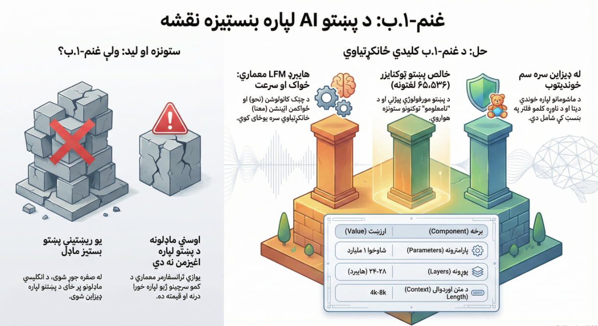

# 🌾 Ghanam-1.B


**Ghanam-1.B** is a native **Pashto Base Language Model** built *from scratch* for education, community use, and long‑term AI infrastructure in the Pashto language.  
The project is designed with a **Pashto‑first philosophy**, avoiding English‑centric assumptions at every layer: data, tokenizer, and architecture.

---

## 📌 Vision

- Build a **foundational Pashto language model** without relying on pretrained English weights
- Support **children, students, and general Pashto users**
- Enable **community fine‑tuning** without dependency on hyperscalers
- Treat Pashto as a *first‑class language*, not a downstream adaptation

---

## 🧠 Model Overview

| Property | Value |
|--------|------|
| Model Name | **Ghanam-1.B** |
| Parameters | ~1 Billion |
| Architecture | **Liquid Foundation Model (Hybrid)** |
| Training | From scratch |
| License | Open (Community‑oriented) |

---

## 🧬 Architecture: Liquid Foundation Model (LFM)

Ghanam-1.B uses a **hybrid architecture** combining:

- **Localized Convolutions** → fast processing of local syntax and morphology
- **Self‑Attention** → long‑range semantic understanding

Typical layer pattern:

```
[Conv] → [Attention] → [Conv]
```

### Why LFM for Pashto?

- Lower compute cost than Transformer‑only models
- Better handling of rich morphology
- Suitable for **low‑resource languages**
- Efficient on small GPU clusters

---

## ⚙️ Model Scale

- **Layers:** 24–28 (Hybrid)
- **Hidden Size:** 2048–2560
- **Attention Heads:** 16–20
- **Context Length:** 4k–8k tokens
- **Precision:** bfloat16

The scale is intentionally chosen to balance **expressive power** and **practical deployability**.

---

## 🔤 Tokenizer (Pashto‑Native)

Ghanam-1.B does **not** use any English‑centric tokenizer.

### Tokenizer Specs

- **Vocabulary Size:** 65,536
- **Training Data:** 100% Pashto
- **Unicode‑aware**
- **Morphology‑friendly**

### Pashto Linguistic Core

The tokenizer is seeded with Pashto‑specific characters:

```
ټ ډ ړ ږ ښ څ ځ ڼ ۍ ې ګ
```

It also learns frequent Pashto morphemes such as:

- ـونه
- ـوال
- ـیز
- ـګر
- ـوالی

This ensures efficient tokenization without semantic fragmentation.

---

## 📚 Data Policy

### Included

- Native Pashto texts
- Educational and child‑safe content
- Narrative and conversational Pashto
- Scientific and encyclopedic Pashto (localized)

### Filtered / Limited

- English‑dominant text
- Roman Pashto
- Urdu slang
- Unadapted Arabic/Farsi constructions

> Pashto‑first does **not** mean anti‑loanwords; it means **Pashto‑dominant**.

---

## 🛡️ Safety by Design

- Profanity filtering at tokenizer level
- Toxic pattern suppression
- No early RLHF (to avoid bias injection)
- Instruction tuning applied *after* base training

Designed to be suitable for **children and educational use**.

---

## 🌍 Community & Openness

- Trainable and runnable on **small clusters**
- Fine‑tune‑friendly for researchers and educators
- No dependency on closed APIs or hyperscalers

The goal is a **community‑owned Pashto AI foundation**.

---

## 🌾 Why the Name "Ghanam"?

**Ghanam (غنم)** means *wheat* — the basic food.

Just as wheat forms the base of nourishment, **Ghanam‑1.B** is designed to be the **base nourishment for Pashto AI systems**.

---

## 🚀 Roadmap

- [ ] Tokenizer training release
- [ ] Full architecture blueprint (PyTorch)
- [ ] Training logs & metrics
- [ ] Instruction‑tuned variants
- [ ] Educational fine‑tunes

---

## 🤝 Contribution

Contributions are welcome from:

- Pashto linguists
- ML researchers
- Educators
- Open‑source contributors

This project grows **with the community**.

---

## 📜 Status

**Ghanam‑1.B** is under active design and development.

> From Pashto. For Pashto. Built to last.

